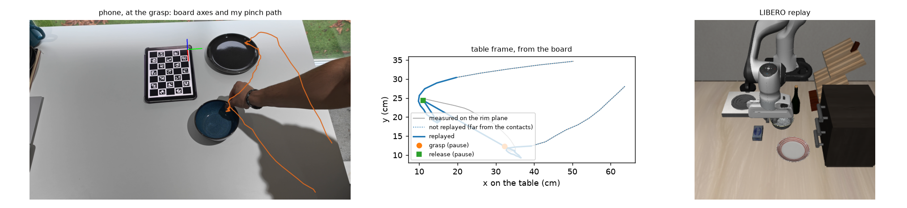
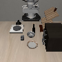
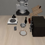
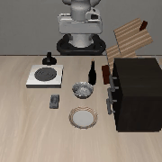
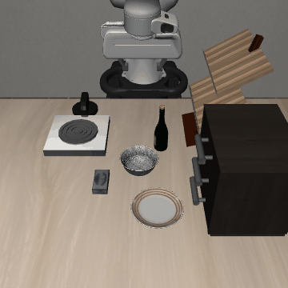
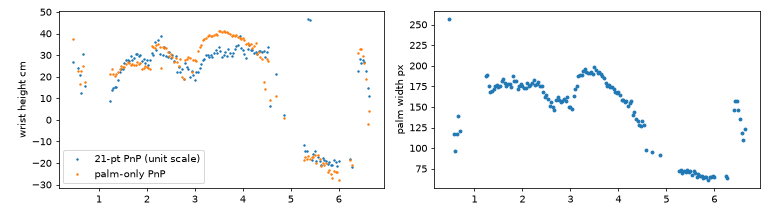

# phone-to-panda

I filmed my own hand putting a bowl on a plate, with a phone held in my other
hand, and used those clips to make a Panda arm do the same task in LIBERO
("put the bowl on the plate", LIBERO-Goal). Each clip is reconstructed on the
table in centimetres, mapped onto the simulated scene, and replayed open loop
in several LIBERO scenes; the replays that succeed become training data for
SmolVLA, compared against the same number of LIBERO's own teleoperated
demonstrations.



## Results

13 demonstrations per side, same model (SmolVLA fine-tuned from
`lerobot/smolvla_base`), 4000 steps, batch 32, seed 0, evaluated on the 50
fixed initial states of the task.

| Training data | Replays kept | Success (of 50) | 95% interval |
|---|---|---|---|
| 13 teleoperated LIBERO demos | | **42** (84%) | 72 to 92% |
| 13 phone clips, wrist turned towards my grasp side | 66 of 104 | 0 (0%) | 0 to 7% |
| 13 phone clips, wrist kept at rest | 40 of 104 | 3 (6%) | 2 to 16% |
| 13 phone clips, wrist at rest, approach cut to the last 10 cm | 64 of 104 | **9** (18%) | 10 to 31% |

The rows are in the order I ran them. Each change came from watching the
previous policy fail and finding the cause in the data:

- **0%:** the policy hovered over the bowl and pushed it. My replays turned
  the gripper to close on whatever side of the bowl my hand had come from, so
  the wrist angle in the training data varied all around the bowl (spread up
  to 0.67 rad in the state's orientation, against at most 0.15 in the
  teleoperated data, where the wrist never turns). With 66 episodes the policy had to learn both
  where to grasp and how far to turn.
- **6%:** with the grasp side snapped to the two sides the Panda reaches
  without turning its wrist, the policy circled the bowl and came down next to
  the cream cheese. It was copying my detours: the replays started from
  wherever my hand entered the frame, so the robot took 165 steps where the
  teleoperators take 91, and the grasp came at step 83 instead of 36.
- **18%:** replaying only my last 10 cm before the grasp and the first 10 cm
  after the release, and starting from the robot's own home pose, the policy
  goes to the bowl and completes the task 9 times.

A phone clip from my kitchen is worth much less than a teleoperated demo, but
most of the loss is not in reconstructing my hand: replayed open loop, the
same clips put the bowl on the plate 71% of the time (ablation below). It is
in learning from those replays. They are still slower than the teleoperated
episodes (147 steps against 91, from the robot's waits and pauses) and carry
wrist corrections from the servo that the teleoperators never make (rotation
command 0.15 against 0.04 on one axis). Those are the next things I would
change.

| | | |
|---|---|---|
|  |  |  |
| trained on my clips, success | same policy, failure | trained on teleoperated demos |

## How it works

### A tablet as the ruler

A ChArUco board shown full screen on an iPad lying flat on the table defines
the table frame. Its square size is measured once with a ruler (31 mm), so
every frame of every clip gets a metric camera pose, and the phone can move
freely while I record. Two calibration clips on different days agreed on the
focal length to 0.1% (1778 vs 1780 px); I kept the one with more viewing
angles. Board reprojection error over the 26 clips is 0.09 to 0.15 px.

### The hand gives a pixel, the table gives the depth

MediaPipe finds the hand; I use only the 2D midpoint of thumb and index
fingertips. Its depth comes from the table: the camera ray through that pixel
is cut with the horizontal plane at the bowl rim's height (bowl height minus
1 cm, measured with the ruler). That is exact whenever the fingers are on the
rim, which is when it matters.

### Grasp and release from the motion

The thumb-index distance is too noisy to say when the fingers close (the
fingertips are inside the bowl). The motion is not: the bowl only moves while
it is held, so the grasp and release are the last two places where the hand
stops, with the carry in between. Pauses closer than 4 cm are one place, which
absorbs tracking noise and small finger adjustments on the rim. A carry
shorter than 12 cm means the pauses were misread (bowl and plate were always
at least 20 cm apart), and the clip is dropped.

### What the robot replays

- Approach and retreat: my hand's path within 10 cm of the grasp and of the
  release, cut at the height the robot will replay rather than at the rim, so
  a raised hand is not projected too far. Farther out my path only says where
  I was standing; the robot comes straight from its home pose.
- Carry: a straight line from the grasp point to the release point, over the
  same duration as mine. While I hold the bowl my hand is well above the rim,
  at a height the phone cannot see, and the measured path is not reliable
  (see below). The two end points are.
- Height: not measured. The gripper rises with horizontal distance from the
  nearest contact point, three times as fast as it moves sideways, up to 10 cm.

### From my table to LIBERO's

Bowl and plate look the same from every side, so the task does not change if
the demonstration is rotated about the bowl. The replay is rotated so that my
carry direction matches LIBERO's bowl-to-plate direction, then pinned at two
points: the grasp lands on the simulated rim and the release leaves the bowl
centred on the plate. In between the shift blends with the distance carried,
so the robot does not slide while its fingers close.

A rim grasp only needs the fingers to close across the wall. The grasp side is
the side my hand came from, snapped to the nearer of the two sides the Panda
reaches with its wrist at rest. The demonstration can also be mirrored across
the carry axis without changing the task; my table was empty and LIBERO's has
a wine bottle next to the bowl, so of the two mirror images the replay uses the
one whose open fingers stay farther from the other objects.

Two playback rules come from the robot, not from me: the gripper switches when
the robot's fingers reach the contact point (at most 1 s of waiting), and it
then holds still for half a second, because the Panda's fingers close much
slower than mine.



### Replayed demos as training data

Each usable clip is replayed in 8 freshly sampled LIBERO scenes; LIBERO's own
success check decides which replays become training episodes, recorded in the
exact format of the `lerobot/libero` dataset (camera orientation, state vector
and action convention checked against it). Evaluation uses LIBERO's 50 fixed
initial states, which the replays never saw.

## Ablation

What each decision in the replay is worth, without any learning: the 13
usable clips replayed open loop in the first 4 fixed LIBERO states (52 runs
per row), with one decision switched off at a time. Every row uses the same
clips and states, but 52 runs is still few: I read only the large gaps, and a
difference of a handful of runs means nothing.

| Replay | Success (of 52) |
|---|---|
| full method | **37** (71%) |
| no half-second pause for the fingers | 15 (29%) |
| my whole approach path, not just the last 10 cm | 21 (40%) |
| descent at 45 degrees instead of three times steeper | 24 (46%) |
| measured carry path instead of the straight line | 26 (50%) |
| gripper switching on my clock, not on arrival | 27 (52%) |
| rays cut at the rim plane instead of the replay height | 33 (63%) |
| no mirror image | 37 (71%) |
| wrist turned towards my grasp side | 48 (92%) |

Two rows say something beyond "this helps". The mirror image no longer changes
anything once the grasp side is snapped. I added it earlier, when on one clip
the open fingers jammed against the wine bottle and mirroring cleared them; I
never measured it on its own before the snapping made it redundant. And turning the
wrist towards my grasp side makes the replay itself more reliable (92%) while
producing the training data the policy could not learn from at all (0 of 50
above). An open-loop replay that works is not the same thing as a good
demonstration.

## What did not work

**Hand depth from MediaPipe.** MediaPipe also predicts 3D hand landmarks;
solving PnP between them and the 2D ones gives a depth for the hand. On my
clips the pinch height came out as low as 40 cm *below* the table. The camera
sees the back of the hand and the fingertips are hidden in the bowl, so the 3D
landmarks are guesses (PnP residual 25 to 45 px on a hand 160 px wide). PnP on
the palm alone (wrist and knuckles, which stay visible) halved the frame to
frame noise but kept the same failure: when I turn my hand to set the bowl
down, the palm seen edge on goes from 175 to 70 px wide and the depth doubles.



**Pauses from the palm.** To make the pause detection less sensitive to the
jittery fingertips I tried detecting pauses from the palm instead. Usable clips
went from 13 to 9: the palm is about 8 cm above the rim, and on the rim plane
every turn of the wrist moves it.

**The measured carry path.** With the carry taken from the video, the replay
overshot the plate on several clips (25 cm on one) and dragged the bowl over
the plate's rim; in the ablation it costs 21 points.

**Framing.** Of the 26 clips I recorded, 13 are usable. In the first batch I
filmed from too far and too low; the bowl and my hand left the frame when I
lifted it, and the hand was lost exactly at the pauses. After moving the phone
closer and higher, 6 of 9 clips passed. The three that still failed have the
hand in view but pauses too short to stand out from fingertip jitter.

## Limitations

- One task, one seed per training run, 50 evaluation episodes: the 18% has an
  interval from 10 to 31%.
- The mapping relies on bowl and plate being round. An object with a front
  and a back would need its own orientation from the video, which this
  pipeline does not estimate.
- My hand's height is never measured. What survives from each clip is the
  path near the contacts, the side of the grasp (snapped to two options), the
  timing and the carry duration.
- Turning a clip into training data uses the simulator's object positions,
  which the policy never sees; the policy itself sees only the cameras and the
  robot state.
- Half of my clips were unusable, almost all from framing. The protocol in
  [docs/recording.md](docs/recording.md) is the version that worked.

## Running it

Linux only (LIBERO). Python 3.12, an NVIDIA GPU for training. One GPU job at a
time: generation, training and evaluation all render with EGL, and four at
once crashed WSL.

```bash
sudo apt install libegl1 libgles2
bash scripts/setup_env.sh
source ~/venvs/phone-to-panda/bin/activate
```

Recording protocol: [docs/recording.md](docs/recording.md). Then, with the
clips in `data/raw/s01/`:

```bash
python scripts/calibrate.py data/raw/s01
python scripts/track.py data/raw/s01 --overlay
python scripts/retarget.py data/raw/s01
python scripts/generate.py data/raw/s01 --per-demo 8 --out outputs/datasets/phone_all
bash experiments/train.sh teleop
bash experiments/train.sh phone
bash experiments/eval.sh ~/runs/teleop13
bash experiments/eval.sh ~/runs/phone13
python scripts/ablate.py data/raw/s01
python scripts/render_replay.py data/raw/s01 demo_020 --state 1
python scripts/figures.py data/raw/s01 demo_020 --sim outputs/figures/demo_020_sim.png
python scripts/make_gifs.py
```

`python scripts/sim_smoke.py 20` checks the simulator side alone with a
hand-made trajectory, no phone data needed. `pytest` runs the tests; each one
checks a piece against a known answer: synthetic camera views for the board
pose and the calibration, rays from known points, pause and contact detection
on a synthetic path, a mapping that must not depend on how the real scene was
rotated, and the state vector against LeRobot's own conversion.

## Layout

```
src/p2p/      board.py camera.py hand.py video.py   perception
              retarget.py                             2D pinch -> table-frame trajectory
              sim_map.py                              table frame -> LIBERO scene
              sim.py                                  servo, playback, LeRobot frames
scripts/      calibrate, track, retarget, generate, ablate, render_replay,
              figures, make_gifs, sim_smoke, make_board, libero_episodes
experiments/  train.sh, eval.sh
docs/         recording.md, board/, figures/, media/
```
